# 화면 매뉴얼

브라우저 화면(규칙·데이터 · 비교 · 결정 과정 · 문제 찾기 · 개선 제안 · Agent workflow · LangGraph agents 탭)의 구성과 사용법이다. 설치와 실행은 [README](../README.md#시작하기)를 본다.

화면에는 쉬운 말을 쓰고, 원래 용어(개발 문서·코드에서 쓰는 이름)는 **마우스를 올리면** 보인다. 대응표는 [11. 용어표](#11-용어표)에 있다.

모든 탭은 **요약을 먼저** 보여주고, 나머지는 **▸ 상세보기 (…)** 를 눌러 펼친다. 괄호 안에 숨은 내용의 양(예: "지표 7개 더 · 미배정 사유")이 적혀 있다. 오른쪽 위 **모두 펼치기**를 켜면 모든 상세보기가 한 번에 열린다(발표·확인용, 브라우저에 기억됨). 정보를 없앤 것은 아니고 접어 둔 것이다.

이 문서의 캡처는 **리허설 번들**(가짜 AI로 미리 만든 결과, API 키 불필요)로 찍었다. 그래서 AI 방식의 판단 근거가 `fake`로 나오고 수치는 AI 성능과 무관하다. 실제 API로 실행하면 같은 자리에 실제 값이 나온다. 지도 배경(OpenStreetMap)은 인터넷이 될 때만 보이며, 캡처는 오프라인 상태라 구 경계만 보인다.

```bash
python -m scripts.rehearsal_bundle              # 리허설 번들 만들기 (몇 초)
python -m api.main --demo demo/rehearsal        # http://127.0.0.1:8000
```

## 1. 화면 구성

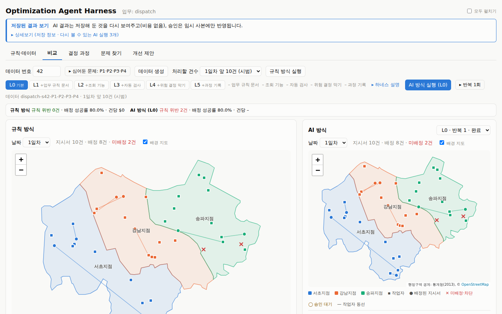

| 영역 | 내용 |
|---|---|
| 상단 배너 ("저장된 결과 보기"일 때만) | 한 줄: AI 결과는 저장해 둔 것을 다시 보여주고 승인은 임시 사본에만 반영된다. **상세보기**에 저장 정보와 **다시 볼 수 있는 AI 실행 목록**(데이터·레벨·건수) |
| 탭 | 규칙·데이터(규칙과 데이터 보기) 다음, 비교 → 결정 과정 → 문제 찾기 → 개선 제안 순서로 쓰는 것을 전제로 한다. 앞 탭에서 만든 데이터·실행·분석을 뒤 탭이 이어받는다 |
| 데이터 생성 줄 | 데이터 번호(같은 번호면 같은 데이터), **▸ 심어둔 문제: P1·P2·…**(누르면 P1~P4 체크박스), **데이터 생성**, **처리할 건수**, **규칙 방식 실행** |
| 하네스 줄 | 하네스 레벨 L0~L5 선택(버튼마다 새로 켜지는 기능 표시), 지금 레벨에서 켜진 기능(✓/–), **▸ 하네스 설명**(처리 흐름 그림), **AI 방식 실행**, **▸ 반복 N회**(누르면 반복 횟수와 모델·생각 깊이·저장된 응답 재사용 설정) |
| 결론 한 줄 (두 방식 모두 실행 후) | 규칙 방식과 AI 방식의 규칙 위반·배정 성공률·건당 비용을 한 줄로 나란히 |

### 하네스 레벨

같은 AI에 붙이는 장치를 단계별로 늘린다. 레벨 버튼에는 바로 아래 레벨보다 **새로 켜지는 기능**이 붙어 있다(설정 파일 `configs/harness_levels.yaml`에서 자동으로 만든다).

| 레벨 | 업무 규칙 문서 | 조회 기능 | 자동 검사 | 위험 결정 막기 | 과정 기록 | 한 줄 설명 |
|---|---|---|---|---|---|---|
| L0 기본 | – | – | – | – | 최종 결과 | 데이터만 주고 결정하게 한다 |
| L1 +업무 규칙 문서 | ✓ | – | – | – | 최종 결과 | 업무 규칙 문서를 함께 준다 |
| L2 +조회 기능 | ✓ | ✓ | – | – | 최종 결과 | 데이터를 통째로 주는 대신 후보 조회·이동시간·일정 확인 기능을 쓰게 한다 |
| L3 +자동 검사 | ✓ | ✓ | ✓ | – | 최종 결과 | 결정이 규칙을 어기는지 바로 검사하고, 어기면 이유를 돌려줘 다시 시도하게 한다 |
| L4 +위험 결정 막기 | ✓ | ✓ | ✓ | ✓ | 최종 결과 | 규칙을 어긴 결정은 막고, 사람 승인이 필요한 조건이면 승인 대기로 둔다 |
| L5 +과정 기록 | ✓ | ✓ | ✓ | ✓ | **모든 단계** | L4 + AI 응답·조회·자동 검사·다시 시도를 모두 기록한다 (결정 과정 탭에서 볼 수 있다) |

#### 하네스 설명 (처리 흐름 그림)

하네스 줄의 **▸ 하네스 설명**을 누르면 선택한 레벨에서 AI가 지시서 하나를 처리하는 흐름이 그림으로 열린다. 레벨 버튼을 바꾸면 그림도 바뀐다.

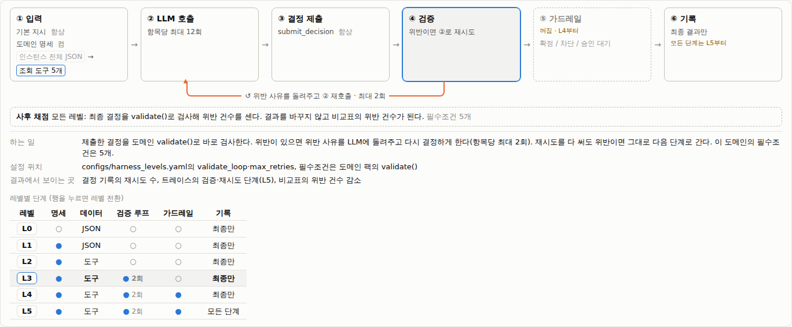

| 부분 | 내용 |
|---|---|
| 단계 ①~⑥ | ① 입력(기본 지시·업무 규칙 문서·데이터) → ② AI 호출(지시서당 최대 호출 수) → ③ 결정 제출(정해진 형식, 모든 레벨) → ④ 자동 검사 → ⑤ 위험 결정 막기 → ⑥ 과정 기록 |
| 꺼진 단계 | 점선·흐리게 표시하고 "꺼짐 · L3부터"처럼 켜지는 레벨을 적는다 |
| 데이터 주는 방식 | 켜고 끄는 것이 아니라 바뀐다: L0·L1은 **데이터 통째로**, L2부터 **조회 기능 N개**. 현재 쪽이 파란 테두리 |
| 다시 시도 화살표 | ④ 아래에서 ②로 되돌아가는 화살표. 자동 검사가 켜진 레벨(L3~)에서만 색이 있다 |
| 마지막 규칙 검사 | 모든 레벨에서 최종 결정이 규칙을 어겼는지 다시 검사해 센다. 결과는 바꾸지 않고 비교표의 규칙 위반 건수가 된다 |
| 단계 설명 | 단계를 누르면 아래에 하는 일, 설정 위치(파일), 결과에서 보이는 곳이 나온다. ① 입력은 조회 기능 목록(이름·설명)도 보여준다 |
| 레벨별 단계 표 | L0~L5 × 단계(●/○). 현재 레벨 행이 강조되고, 행을 누르면 그 레벨로 바뀐다 |

### 처리할 건수

- **1일차 앞 10건 (시범)**: AI 비용을 확인하는 첫 실행용. 리허설 번들의 AI 결과도 이 건수다.
- **N일차 (150건)**: 하루치.
- **전체 1500건**: 10일치. 규칙 방식은 비용이 없으니 전체로 돌려도 된다.

AI 방식을 실행하면 **같은 건수로 규칙 방식도 함께 실행**되어 왼쪽(규칙 방식)과 오른쪽(AI 방식)을 나란히 비교한다.

## 2. 규칙·데이터 탭 (읽기 전용)

규칙 방식이 판단에 쓰는 **규칙과 데이터**를 본다. 여기서는 아무것도 바꾸지 않는다. 규칙은 개선 제안 탭에서 제안을 승인해야만 바뀐다. 위쪽 버튼으로 섹션을 고른다.

| 섹션 | 내용 |
|---|---|
| 개요 | 규칙 설정값 버전, 지켜야 할 규칙·분석 조건·심어둔 문제 수, 파일 위치와 역할, 현재 데이터 |
| 규칙 설정값 | `params.yaml` 묶음별 표: 현재 값, 바꿀 수 있는 범위(최솟값=최댓값이면 "고정"), 설명. 특정 조건에만 적용하는 규칙 목록과 승인 이력(버전 변화) |
| 지켜야 할 규칙·미배정 사유·분석 조건 | 지켜야 할 규칙(어기면 배정 무효), 미배정 사유(공통 사유 포함), 결과를 나눠 보는 분석 조건 |
| 업무 규칙 문서 | `domain-spec.md`의 6개 부분. L1 이상에서 AI 방식에게 이 문장이 그대로 전달된다 |
| 데이터 | 지점·작업자·지시서 표 (검색, 드롭다운 필터, 머리글 눌러 정렬, 100건씩 더 보기). **행을 누르면 오른쪽 지도에서 위치를 강조하고 그곳으로 이동한다**: 지시서는 그날의 지시서와 함께, 작업자는 출발 위치, 지점은 관할 구역 |
| 심어둔 문제 | P1~P4의 이름과 결과에 나타날 현상. **정답 보기**를 누르면 심는 방법과 채점 기준이 보인다 (발표 중에는 분석 장면 뒤에 연다) |

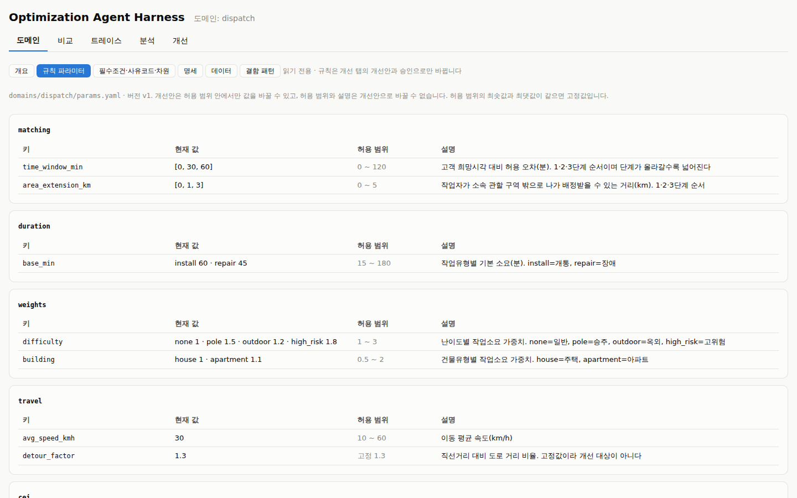

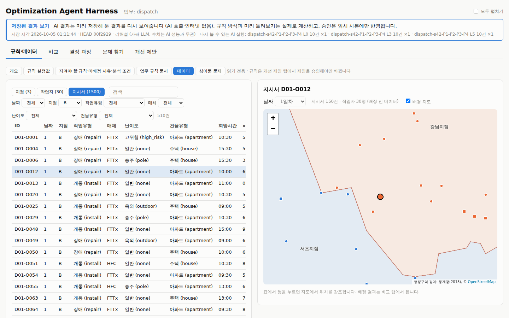

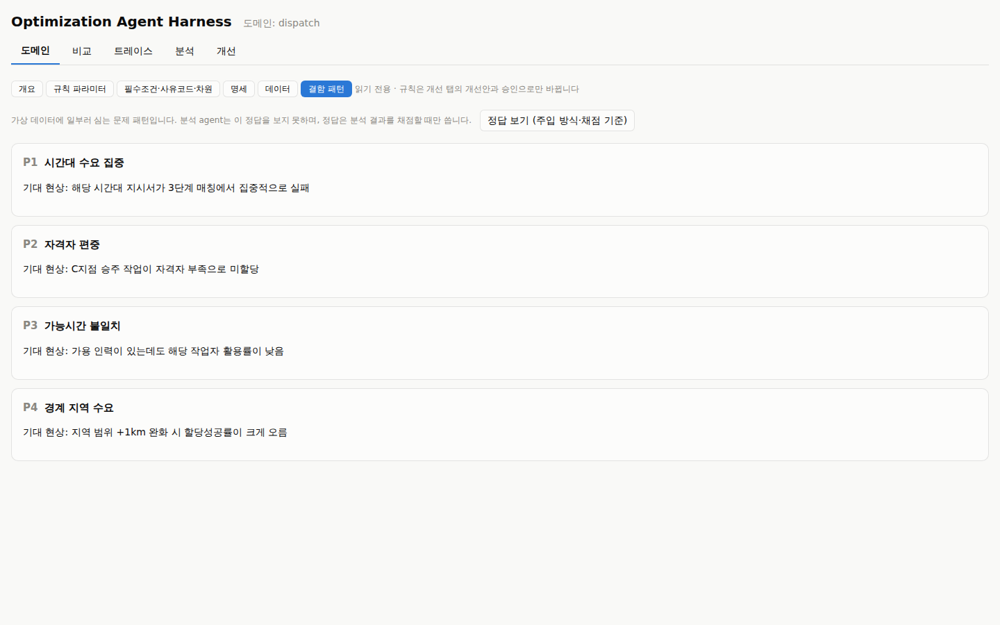

데이터 섹션은 데이터가 있어야 보인다. 없으면 **기본 데이터 생성**을 누른다(비교 탭의 데이터 번호·심어둔 문제 설정을 쓴다).

## 3. 비교 탭

### 지도 (서울 강남3구)

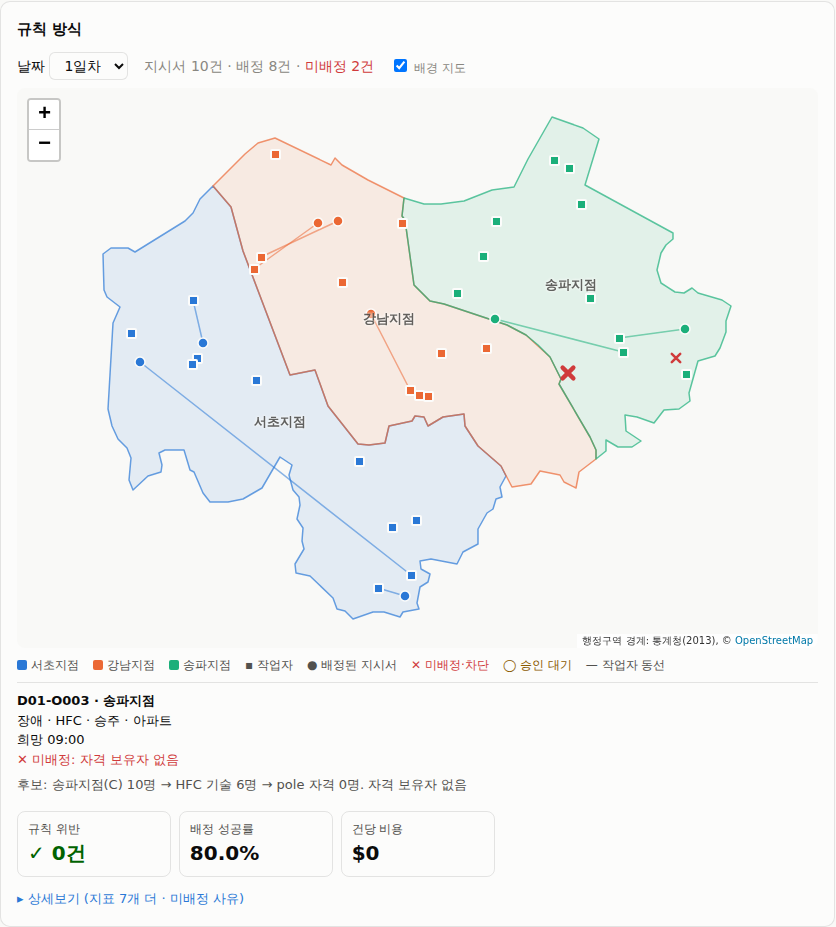

| 표시 | 뜻 |
|---|---|
| 색칠된 구역 | 지점별 관할 구역. 파랑 = 서초지점(A), 주황 = 강남지점(B), 초록 = 송파지점(C) |
| ▪ 작은 사각형 | 작업자 출발 위치 (지점 색) |
| ● 원 | 배정된 지시서 (지점 색) |
| ✕ 빨간 X | 미배정 또는 위험 결정 막기로 차단 |
| ◯ 노란 테두리 | 승인 대기 (L4·L5) |
| 선 | 작업자의 당일 동선 (출발 위치 → 배정된 지시서를 시작 시각 순으로) |

- **날짜**: 처리할 건수에 포함된 날만 고를 수 있다.
- **배경 지도**: 인터넷이 되면 OpenStreetMap이 흐리게 깔린다. 체크를 끄면 구 경계만 보인다.
- 지도는 `+`/`−` 버튼으로 확대하고 드래그로 이동한다(스크롤 확대는 페이지 스크롤과 겹쳐서 껐다).
- 점에 마우스를 올리면 지시서·작업자 요약이 뜨고, **지시서를 클릭하면 아래에 판단 근거**가 나온다. 규칙 방식은 후보가 어떻게 줄었는지(지점 → 기술 → 자격 → 조건 완화 단계)를 문장으로 남긴다.
- 관할 구역 밖(경계 너머)에 찍힌 지시서는 P4(경계 지역 수요) 문제다. 관할 밖 거리가 가장 많이 완화한 범위보다 멀면 "갈 수 있는 거리 밖"으로 미배정된다.

### 지표 카드

처음에는 핵심 카드 3개(**규칙 위반 · 배정 성공률 · 건당 비용**)만 보이고, 나머지 지표·건당 처리 시간·미배정 사유 그래프·어긴 내용 표는 **상세보기**에 있다. 카드 이름에 마우스를 올리면 원래 용어와 계산 방식이 보인다.

| 지표 | 계산 |
|---|---|
| 규칙 위반 | 레벨과 관계없이 모든 결정을 같은 기준으로 다시 검사한 위반 건수. 0건이 목표 |
| 배정 성공률 | 배정된 지시서 ÷ 전체 지시서 |
| 희망시간 준수율 | 배정된 지시서 중 고객 희망시각에 정확히 시작한 비율 |
| 평균 이동시간 | 직전 위치에서 지시서까지 이동시간(직선거리 × 우회계수 1.3 ÷ 평균 30km/h)의 평균 |
| 작업자 가동률 | 작업 시간 합 ÷ 작업자 가능시간 합 |
| 조건 그대로 / 조금 완화해 / 많이 완화해 배정 | 배정 건 중 시간·지역 조건을 완화하지 않고, 한 단계 완화해서, 최대로 완화해서 배정한 비율 |
| 건당 비용·처리 시간 | AI는 AI 호출 비용, 규칙 방식은 $0 |

아래 막대그래프는 미배정 사유("자격 보유자 없음", "일정이 꽉 참", "갈 수 있는 거리 밖" 등)별 건수다. 막대에 마우스를 올리면 설명 문장과 사유 코드가 보인다.

### 레벨별 비교표

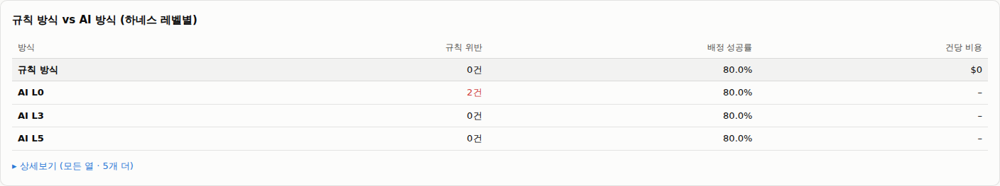

같은 데이터·같은 건수로 실행한 규칙 방식과 AI 방식(레벨별)을 한 줄씩 비교한다. 요약 표는 규칙 위반·배정 성공률·건당 비용만, **상세보기**를 펼치면 실행 횟수·다른 지표·반복 시 같은 결과·건당 시간까지 모든 열이 나온다. 위 캡처에서 L0은 규칙 위반 2건이 남고 L3·L5는 자동 검사 덕분에 0건이다. **반복 시 같은 결과**는 같은 레벨을 2회 이상 반복 실행했을 때 모든 실행에서 결정이 같은 지시서의 비율이다.

## 4. 결정 과정 탭

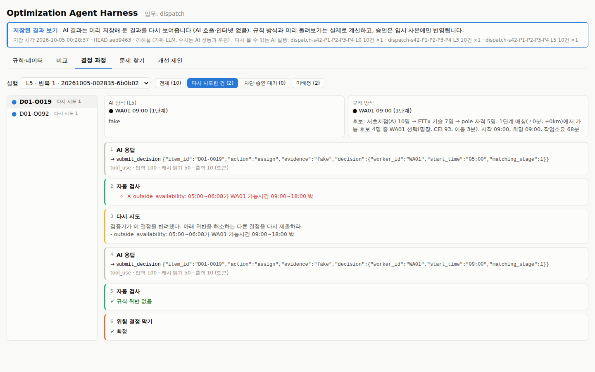

AI 방식이 지시서 하나를 어떻게 결정했는지 단계별로 본다. **단계 기록은 과정 기록이 켜진 레벨(L5) 실행에만 있다** (L0~L4는 최종 결정만 기록).

1. **실행**을 L5로 고른다.
2. 필터로 좁힌다: 전체 / **다시 시도한 건** / 차단·승인 대기 / 미배정.
3. 왼쪽 목록에서 지시서를 고르면 맨 위에 **결론 카드**, 그 아래 AI 방식과 규칙 방식의 최종 결정이 나란히, 그 아래 **단계 흐름 한 줄**이 나온다.
4. 단계별 내용(AI 응답 원문, 조회 결과, 토큰)은 **상세보기**를 펼쳐 본다(캡처는 펼친 상태).

| 요약 | 뜻 |
|---|---|
| 결론 카드 | 지시서 · AI 방식의 최종 상태(배정 / 미배정 / 차단 / 승인 대기) · **규칙 방식과 같은 결정인지** · 다시 시도 횟수 · 자동 검사에서 걸린 횟수 |
| 단계 흐름 한 줄 | 예: `AI 응답 → 자동 검사 ✕ → 다시 시도 → AI 응답 → 자동 검사 ✓ → 위험 결정 막기 ✓`. 같은 단계가 이어지면 `조회 ×3`처럼 묶는다 |

| 단계 | 뜻 |
|---|---|
| AI 응답 | AI가 요청한 조회·결정. 사용한 토큰 수 표시 |
| 조회 | 후보 조회·이동시간·일정 확인 등의 입력과 결과 |
| 자동 검사 | 결정이 규칙을 어기는지 검사한 결과 (✕ 어긴 규칙과 내용 / ✓ 규칙 위반 없음) |
| 다시 시도 | 자동 검사가 돌려보내며 AI에게 준 메시지 |
| 위험 결정 막기 | 확정 / 차단 / 승인 대기 |

## 5. 문제 찾기 탭

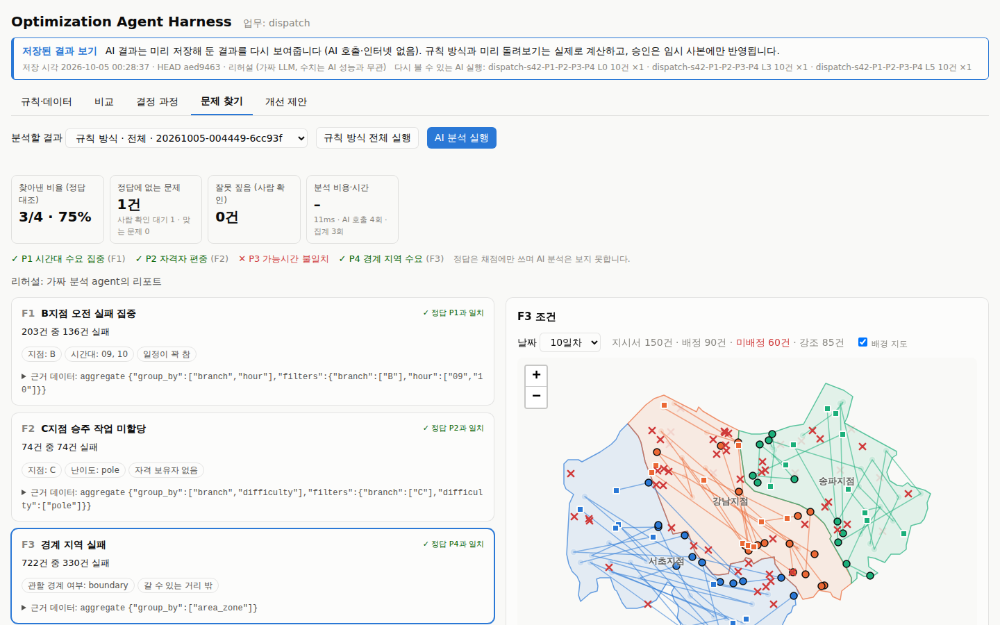

AI 분석이 실행 결과를 여러 조건으로 집계해 보고 반복되는 문제와 추정 원인을 낸다. 심어둔 문제(P1~P4)를 찾는지 정답과 대조한다.

1. **규칙 방식 전체 실행** (1500건, 비용 없음) → **분석할 결과**에서 고른다.
2. **AI 분석 실행**.

맨 위 **결론 한 줄**에 "심어둔 문제 4개 중 3개 찾음 (75%)", 문제별 ✓/✕, 사람 확인 대기 건수가 나온다. 찾은 문제는 카드마다 **제목, 정답 일치 여부(또는 사람 확인 버튼), 조건 칩**만 먼저 보이고 설명·추정 원인·근거 데이터는 카드의 **상세보기**에 있다. 아래 표의 수치 카드는 결론 줄 아래 **상세보기 (정답 대조 · 분석 비용·시간)**에 있다.

| 요소 | 뜻 |
|---|---|
| 찾아낸 비율 (정답 대조) | 심어둔 문제 중 찾은 비율. 정답은 채점에만 쓰며 AI 분석은 보지 못한다 |
| 정답에 없는 문제 | 정답에 없는 찾은 문제. 사람이 **맞는 문제 / 잘못 짚음**으로 확인한다 (확인 대기 건수 표시) |
| 잘못 짚음 (사람 확인) | 사람이 잘못 짚었다고 확인한 건수 |
| 분석 비용·시간 | AI 호출 수, 집계 횟수, 비용 |
| ✓/?/✕ 문제 (결론 줄) | 심어둔 문제별로 찾았는지. **?**는 근거는 맞고 원인 확인을 기다리는 문제(아래). 마우스를 올리면 일치한 찾은 문제 ID |
| 원인 확인 (찾은 문제 카드) | 원인 해석이 중요한 문제(예: P3 가능시간 불일치)는 근거가 정답과 맞아도 바로 찾은 것으로 세지 않는다. 카드의 **원인 맞음 / 원인 틀림**으로 사람이 판정해야 ✓ 또는 ✕가 된다 |
| 찾은 문제 카드 | 제목, 조건 칩(예: "관할 경계 여부: 경계 지역", 마우스를 올리면 원래 값), 미배정 사유. 상세보기에 수치 설명, 추정 원인, **근거 데이터**(AI가 인용한 집계와 결과 표) |

- 찾은 문제의 제목을 누르면 **오른쪽 지도에서 해당 조건의 지시서만 강조**되고 나머지는 흐려진다. 강조된 지시서가 가장 많은 날짜가 자동으로 선택된다.
- 찾은 문제의 숫자는 인용한 집계 결과에 실제로 있는 값이어야 한다. 근거가 확인되지 않은 것은 "근거 숫자가 확인되지 않아 뺀 찾은 문제"로 따로 모인다.
- **관점별로 분석**(AI 분석 실행 옆 체크): 실패 패턴·자원 활용·시간 수급 관점마다 AI를 따로(동시에) 돌린 뒤 합친다. 비용은 관점 수만큼 늘어난다(약 3배).
  - 카드: "관점: …" 칩은 그 문제를 찾은 관점이다. 여러 관점이 같은 문제를 찾았으면 상세보기에 **다른 관점의 해석**이 나란히 나온다. 어느 해석이 맞는지는 사람이 판단한다.
  - 상세보기 (정답 대조 · 분석 비용·시간): 관점별 카드에 발견 수, 비용, 시간, 실패가 나온다. 한 관점이 실패해도 나머지 관점으로 리포트가 나온다.

## 6. 개선 제안 탭

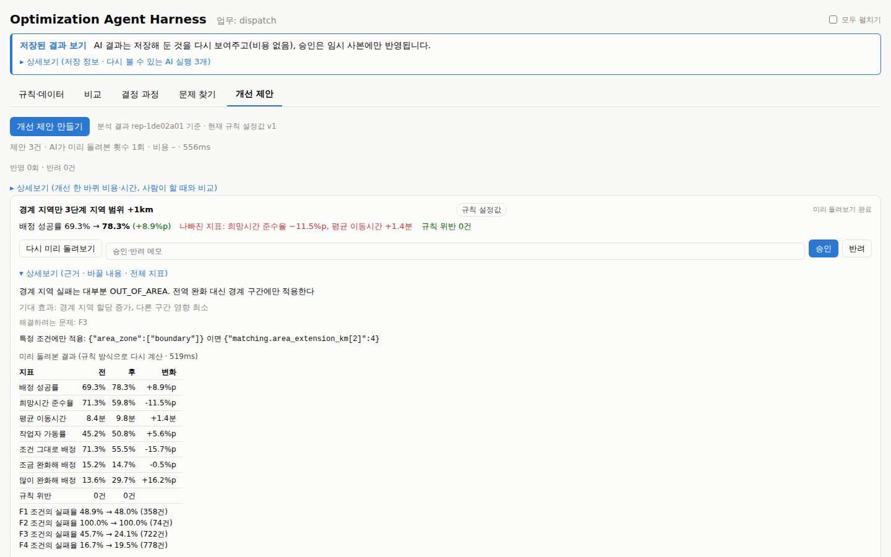

분석 결과를 바탕으로 규칙을 어떻게 바꿀지 제안을 만들고, 미리 돌려봐 효과를 확인한 뒤 사람이 승인한다.

1. **개선 제안 만들기** (문제 찾기 탭에서 만든 분석 결과 기준).
2. 제안마다 **미리 돌려보기** → 카드 제목 아래 **요약 한 줄**에 배정 성공률 전 → 후(변화), **나빠진 지표**(없으면 "나빠진 지표 없음"), 규칙 위반 건수가 나온다. 근거·바꿀 내용·전·후 전체 지표 표는 카드의 **상세보기**에 있다.
   - 규칙 설정값(params.yaml)을 바꾸는 제안은 규칙 방식을 다시 계산해 바로 비교한다(비용 없음).
   - 업무 규칙 문서(domain-spec.md)를 고치는 제안은 AI 방식을 고치기 전·후 문서로 실행해야 하므로 **예상 비용을 먼저 보여주고 확인을 받는다**. 레벨과 건수를 고를 수 있다.
3. 메모를 적고 **승인** 또는 **반려**.

| 제안 상태 | 뜻 |
|---|---|
| 제안됨 | 미리 돌려보기 전 |
| 적용 불가 | 바꿀 수 있는 범위(params.yaml의 bounds) 밖이거나 형식 오류. 이유가 빨간 글씨로 나온다 |
| 미리 돌려보기 완료 | 승인할 수 있다 |
| 승인됨 / 반려됨 | 결정 완료. 승인하면 규칙 설정값 버전이 오른다 |
| 기준이 바뀜 | 다른 제안이 먼저 승인되어 기준 파일이 바뀌었다. 다시 제안해야 한다 |

- 제안 종류: **규칙 설정값**(값 변경, 또는 "경계 지역만"처럼 특정 조건에만 적용) / **업무 규칙 문서**(부분 교체, 현재·제안 비교 펼침).
- **기억**: 반려 사유와 문제 찾기의 판정(잘못 짚음, 원인 맞음·틀림)은 다음 회차 AI 입력으로 돌아간다. 개선 제안 탭의 **기억** 펼침에서 다음 회차에 알려 줄 내용을 볼 수 있고, 제안 묶음과 분석 결과에 "사용한 기억 n건"이 표시된다. 규칙 버전이 바뀐 뒤의 기억은 "이전 규칙(vN) 기준"으로 표시된다. 그래서 **반려할 때 메모(사유)를 적는 것이 중요하다.**
- **제약 위반**: 개선 제안을 만들 때 사람이 정한 한도(예: "관할 확장 4km까지", "정시 배정 비율 감소 3%p까지")가 함께 주어졌다면, 상단에 **적용한 제약** 목록(누가, 왜)이 펼침으로 나오고, 미리 돌려본 결과가 한도를 넘는 제안에는 **⚠ 제약 위반** 배지와 내용이 붙는다. 승인은 막지 않으며 사람이 판단한다. 제약은 이 화면에서 입력하지 않고 API(`POST /proposals`의 `constraints`)로 받는다.
- **승인은 파일에만 반영한다. git 커밋은 사람이 직접 한다.** "저장된 결과 보기"에서는 임시 사본에만 반영되고, 서버를 다시 켜면 처음 상태로 돌아간다.
- 상단 한 줄: 반영·반려 횟수와 마지막 개선 한 바퀴의 비용·시간. **상세보기**에 개선 한 바퀴에 AI가 쓴 시간·비용, 같은 분석을 사람이 할 때의 추정 시간(직접 입력, 브라우저에만 저장) 카드가 있다.

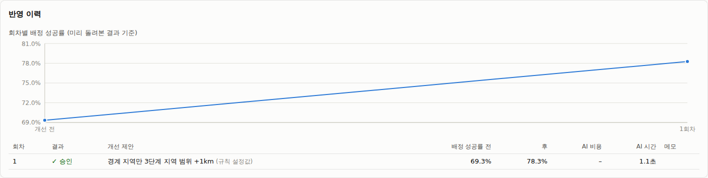

**반영 이력**은 승인한 회차별 배정 성공률 추이(미리 돌려본 결과 기준)와 회차 표(제안, 전·후, AI 비용·시간, 메모)다.

## 7. Agent workflow 탭 (LangGraph)

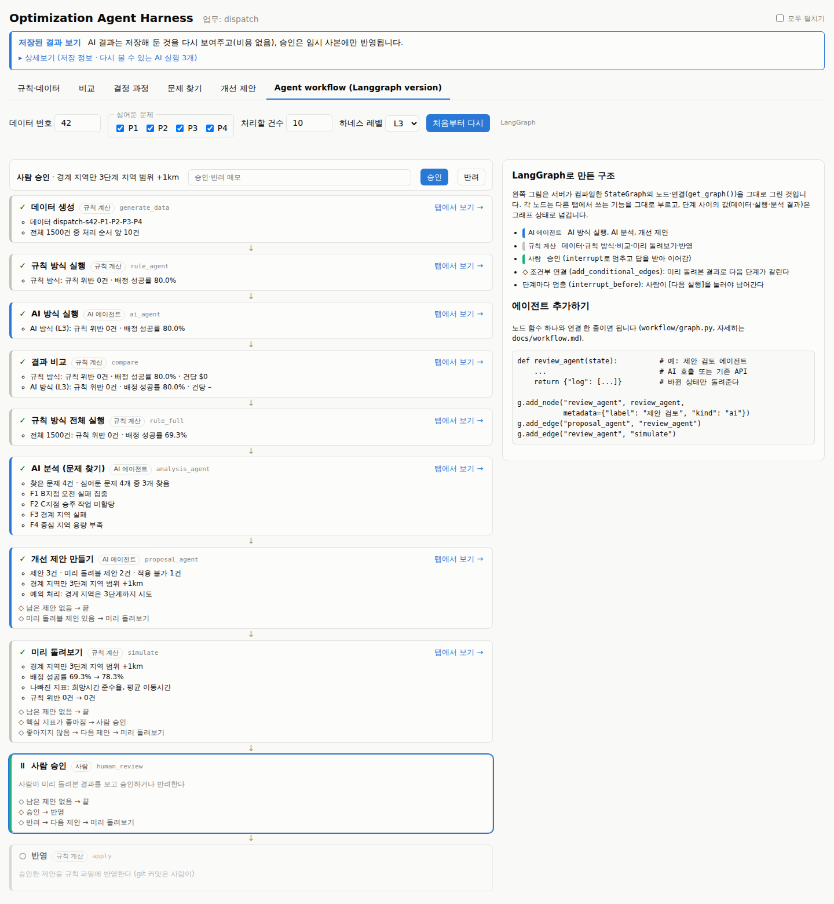

위 탭에서 하나씩 누르던 단계를 **LangGraph 그래프 하나**로 묶어 한 번에 흘려 본다. 각 단계(에이전트)를 넘어갈 때마다 멈추고, 사람이 **[다음 실행]**을 눌러야 다음 단계로 간다. 흐름만 간단히 보여주는 화면이고, 각 단계의 자세한 결과는 노드의 **[탭에서 보기 →]**로 해당 탭에서 본다(그 탭이 같은 데이터·실행·분석·제안을 이어받는다). 구조와 노드 추가 방법은 [docs/workflow.md](workflow.md).

1. 데이터 번호, 심어둔 문제, 처리할 건수(처리 순서 앞 N건), 하네스 레벨을 고르고 **워크플로우 준비** → 첫 단계(데이터 생성) 앞에서 멈춘다.
2. **[다음 실행 ▶]**을 누를 때마다 한 단계씩 실행되고, 노드 아래에 결과 한 줄이 붙는다.
3. 미리 돌려본 결과 핵심 지표가 좋아지면 **사람 승인**에서 멈춘다 → 메모를 적고 **[승인]** 또는 **[반려]**. 반려하면 다음 제안을 미리 돌려본다.
4. 승인 후 **[다음 실행]** → 반영 → 끝.

| 요소 | 뜻 |
|---|---|
| 노드 색 (왼쪽 띠) | 파랑 = AI 에이전트 (AI 방식 실행, AI 분석, 개선 제안), 회색 = 규칙 계산, 초록 = 사람 |
| 노드 표시 | ○ 대기 · ▶ 다음 · … 실행 중 · ✓ 완료 · ⏸ 사람 승인 대기 · ✕ 실패 (같은 단계 [다시 실행]) |
| ◇ 줄 | 조건부 연결: 결과에 따라 다음 단계가 갈린다 (예: 핵심 지표가 좋아짐 → 사람 승인) |
| 오른쪽 상자 | LangGraph로 만든 구조 설명과 에이전트 추가 예시 코드 |

- 그림은 손으로 그린 것이 아니라 서버가 컴파일한 그래프(`get_graph()`)의 노드·연결이다. 노드를 추가하면 그림에도 바로 나온다.
- LangGraph가 설치되어 있지 않으면 설치 안내(`pip install -e ".[workflow]"`)만 나온다.
- "저장된 결과 보기"에서는 리허설 번들 조건(데이터 번호 42, P1~P4, 10건, L0·L3·L5)으로 실행해야 AI 단계가 저장된 결과를 찾는다.

## 8. LangGraph agents 탭

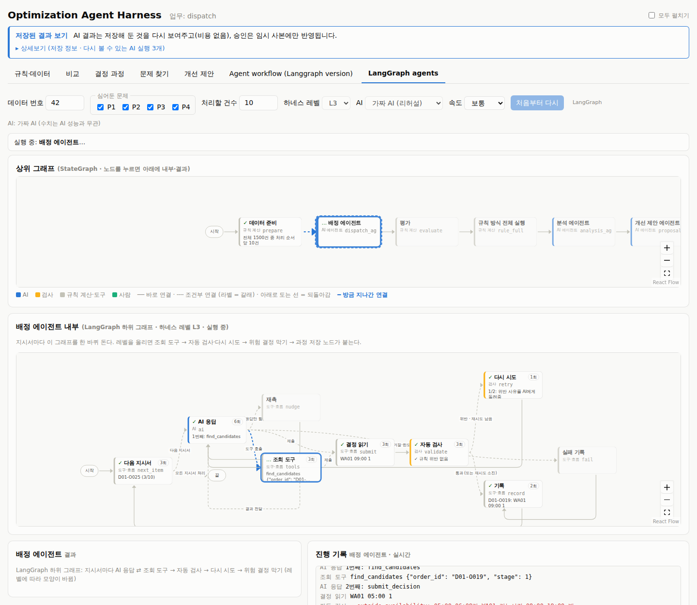

배정·분석·개선 제안 **에이전트의 내부까지 LangGraph로** 만든 별도 탭이다. 7장(Agent workflow)이 기존 에이전트를 노드로 이어 붙였다면, 여기서는 AI 응답·조회 도구·자동 검사·다시 시도가 모두 그래프의 노드와 연결이다. 결과는 이 탭 안에서만 쓰고(다른 탭·기록에 섞이지 않음), 승인한 제안만 규칙 파일에 반영한다. 구조와 에이전트 추가 방법은 [docs/langgraph-agents.md](langgraph-agents.md).

1. 데이터 번호, 심어둔 문제, 처리할 건수, **하네스 레벨**, **AI**(가짜 AI / Claude API), **속도**를 고른다.
   - 하네스 레벨을 바꾸면 **배정 에이전트 내부** 그래프가 바로 다시 그려진다: L0은 AI 응답 → 결정 읽기 → 기록뿐이고, 레벨을 올릴수록 조회 도구 → 자동 검사·다시 시도 → 위험 결정 막기 → 과정 저장 노드가 붙는다.
   - "저장된 결과 보기"에서는 가짜 AI만 쓴다(비용 없음, 수치는 AI 성능과 무관). Claude API는 실제 비용이 든다.
   - 속도는 내부 단계 사이 간격이다(가짜 AI는 너무 빨라 눈으로 따라가기 어렵다).
   - **관점별 분석**을 켜면 분석 에이전트 내부가 "시작 → 관점 노드 3개(동시에) → 합치기"로 다시 그려진다. 진행 기록에 세 관점의 단계가 섞여 쌓인다(동시에 돌기 때문).
2. **에이전트 준비** → 첫 단계(데이터 준비) 앞에서 멈춘다.
3. **[다음 실행 ▶]**을 누르면 다음 단계(에이전트 하나)가 끝까지 실행된다. 실행되는 동안 아래의 에이전트 내부 그래프에서 지금 노드가 강조되고, **방금 지나간 연결이 움직이는 선**으로 표시되며, 노드별 지나간 횟수와 **진행 기록**이 실시간으로 쌓인다.
4. 미리 돌려본 결과 핵심 지표가 좋아지면 **사람 승인**에서 멈춘다 → **[승인]**/**[반려]**. 반려하면 다음 제안(업무 규칙 문서 제안이면 배정 에이전트를 전·후로 다시 실행)을 미리 돌려본다.

| 요소 | 뜻 |
|---|---|
| 위 줄 (상위 그래프) | 왼쪽→오른쪽 그래프: 데이터 준비 → 배정 에이전트 → 평가 → 규칙 방식 전체 실행 → 분석 에이전트 → 개선 제안 에이전트 → 미리 돌려보기 → 사람 승인 → 반영. 카드에 결과 한 줄. 화면보다 넓어서 **실행 중인 노드로 화면이 따라간다** (끌어서 이동, 오른쪽 아래 +/−로 확대) |
| 노드 누르기 | 그 단계의 결과를 맨 아래 왼쪽에, 에이전트면 그 내부 그래프를 가운데 줄에 고정해서 본다 (다시 누르면 실행 중인 것을 따라간다). 점선 테두리가 고른 노드 |
| 가운데 줄 (에이전트 내부) | 고른 에이전트의 하위 그래프. 카드에 지나간 횟수와 마지막 기록, 지금 노드는 강조 |
| 연결선 | 실선 = 바로 연결, 점선 + 라벨 = 조건부 연결(갈래 이름), 노드 아래로 도는 선 = 되돌아감(다시 시도, 결과 전달, 다음 지시서), 노드 위 고리 = 자기 자신으로(다음 제안), **파란 움직이는 선 = 방금 지나간 연결** |
| 카드 색 (왼쪽 띠) | 파랑 = AI, 주황 = 검사, 회색 = 규칙 계산·도구, 초록 = 사람 |
| 맨 아래 | 왼쪽 = 고른(또는 실행 중인) 단계의 결과, 오른쪽 = 진행 기록 (노드 이름 + 한 줄, ✕ 빨강 / ✓ 초록) |

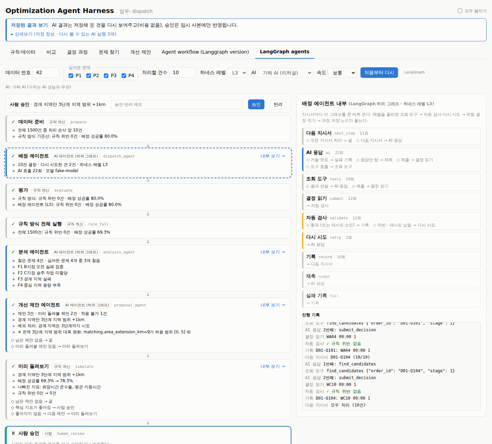

## 9. 리허설 번들로 한 바퀴

1. (선택) 규칙·데이터 탭: 규칙 설정값과 업무 규칙 문서를 훑어본다. 심어둔 문제의 정답은 분석까지 끝난 뒤에 연다.
2. 비교 탭: P1~P4 모두 체크, 데이터 번호 42 → **데이터 생성** → 처리할 건수 **1일차 앞 10건 (시범)**.
3. **L0** 선택 → AI 방식 실행 → 오른쪽 지도·비교표 확인 (규칙 위반 남음).
4. **L3**, **L5**도 실행 → 비교표에서 규칙 위반이 0건이 되는 것을 확인.
5. 결정 과정 탭: 실행 L5, 필터 **다시 시도한 건** → 지시서 선택 → 자동 검사 반려 → 다시 시도 → 확정 흐름.
6. 문제 찾기 탭: **규칙 방식 전체 실행** → **AI 분석 실행** → 찾아낸 비율 3/4, "경계 지역 실패"를 눌러 지도 강조. 정답에 없는 문제(F4)에 맞는 문제/잘못 짚음 확인.
7. 개선 제안 탭: **개선 제안 만들기** → "경계 지역만 3단계 지역 범위 +1km" **미리 돌려보기** → 배정 성공률 상승 확인 → **승인** → 반영 이력.

## 10. 자주 막히는 곳

| 증상 | 원인과 해결 |
|---|---|
| "저장된 AI 실행이 없음" (저장된 결과 보기) | 번들에 없는 조건(데이터·레벨·건수)으로 실행했다. 상단 배너의 **다시 볼 수 있는 AI 실행**과 같게 맞춘다 (리허설 번들: P1~P4, 데이터 번호 42, 1일차 앞 10건, L0·L3·L5) |
| "LLM 클라이언트를 만들 수 없음" | API 키가 없다. `.env`에 `ANTHROPIC_API_KEY`를 넣거나, 리허설 번들로 "저장된 결과 보기"를 쓴다 |
| 문제 찾기·개선 제안 탭이 비어 있음 | 앞 탭의 단계가 필요하다: 문제 찾기는 끝난 실행이, 개선 제안은 분석 결과가 있어야 한다 |
| 제안이 모두 승인됨·반려됨이라 다시 못 해 봄 | "저장된 결과 보기"는 서버를 다시 시작하면(`Ctrl+C` 후 재실행) 처음 상태로 돌아간다 |
| 지도에 도로·지명이 안 보임 | 인터넷이 안 되거나 **배경 지도** 체크가 꺼져 있다. 구 경계와 데이터는 그대로 동작한다 |
| 결정 과정에 단계가 없음 | L0~L4 실행을 골랐다. 단계 기록은 과정 기록이 켜진 L5에만 있다 |
| LangGraph agents 탭이 "가짜 AI를 쓸 수 없음" | 가짜 AI는 레포 안의 리허설 정책을 쓴다. 설치된 패키지가 아니라 레포에서 서버를 실행한다 |
| Agent workflow 탭에 설치 안내만 나옴 | LangGraph가 없다: `pip install -e ".[workflow]"` 후 서버를 다시 켠다 |

## 11. 용어표

화면의 쉬운 말과 원래 용어(개발 문서·코드·설정 파일에서 쓰는 이름)의 대응이다. 화면에서는 마우스를 올리면 원래 용어가 보인다. 목록의 원본은 `web/src/terms.ts`(공통)와 `web/src/domains/dispatch/index.ts`(출동 업무의 지표·사유 이름)다.

| 화면 | 원래 용어 |
|---|---|
| 규칙·데이터 / 비교 / 결정 과정 / 문제 찾기 / 개선 제안 (탭) | 도메인 / 비교 / 트레이스 / 분석 / 개선 탭 |
| 규칙 방식 / AI 방식 | 규칙 agent (기준선) / AI agent |
| AI 분석 | 분석 agent |
| 업무 | 도메인 |
| 데이터 번호 / 심어둔 문제 / 처리할 건수 / 데이터 | seed / 결함 패턴 (faults.yaml) / 실행 범위 (scope) / 데이터셋 |
| 저장된 결과 보기 | 시연 모드 (재생) |
| 하네스 레벨 | 하네스 레벨 (그대로) |
| 업무 규칙 문서 / 조회 기능 / 자동 검사 / 위험 결정 막기 / 과정 기록 | 도메인 명세 (domain-spec.md) / 도구 (tools) / 검증 루프 (validate_loop) / 가드레일 (guardrail) / 트레이스 (trace) |
| AI 호출 / AI 응답 / 조회 / 다시 시도 | LLM 호출 / LLM 응답 / 도구 호출 / 재시도 |
| 데이터 통째로 | 인스턴스 전체 JSON |
| 규칙 위반 / 마지막 규칙 검사 | 필수조건 위반 (사후 채점) / 사후 채점 |
| 지켜야 할 규칙 | 필수조건 (violation_rules) |
| 미배정 / 미배정 사유 | 미할당 (failed) / 사유 코드 (reason_codes) |
| 배정 성공률 / 희망시간 준수율 / 작업자 가동률 | 할당성공률 / 희망시간 일치율 / 작업자 활용률 |
| 조건 그대로 / 조금 완화해 / 많이 완화해 배정 | 1 / 2 / 3단계 매칭 |
| 반복 시 같은 결과 | 일관성 |
| 분석 조건 / 조건 | 분석 차원 (dimensions) / 구간 (slice) |
| 찾은 문제 / 근거 데이터 / 추정 원인 | 발견 (finding) / 근거 (인용한 도구 호출) / 가설 |
| 찾아낸 비율 / 정답에 없는 문제 / 맞는 문제 / 잘못 짚음 / 정답 | 패턴 탐지율 / 정답과 매칭 안 된 발견 / 정당한 발견 / 오탐 / 정답표 |
| 개선 제안 / 미리 돌려보기 / 적용 불가 | 개선안 / 시뮬레이션 / 검증 실패 |
| 규칙 설정값 / 바꿀 수 있는 범위 / 특정 조건에만 적용 | 규칙 파라미터 (params.yaml) / 허용 범위 (bounds) / 구간 조건 (overrides) |
| 반영 이력 / 반영 횟수 | 개선 이력 / 반영된 회차 |
| 생각 깊이 / 저장된 응답 재사용 | effort / 응답 캐시 |
